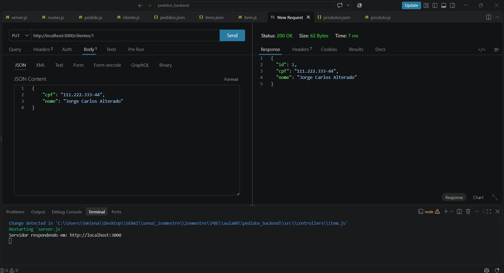
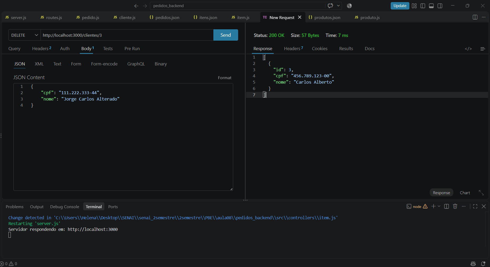
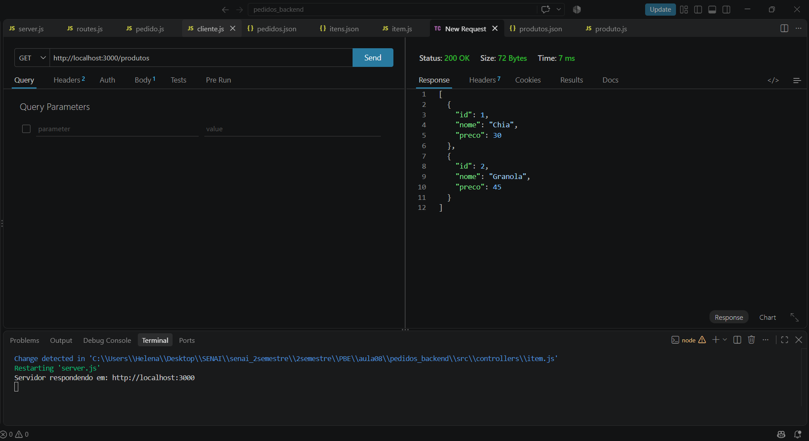
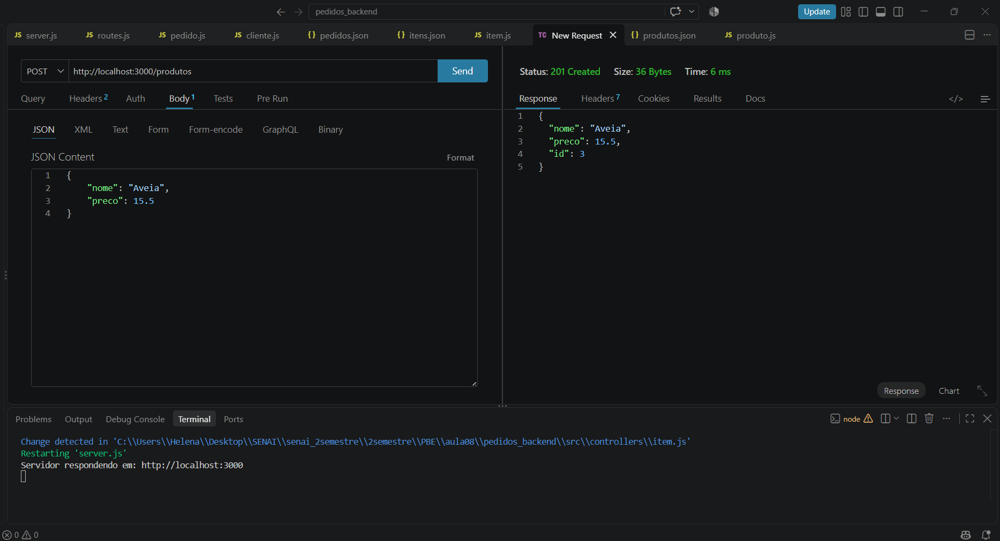
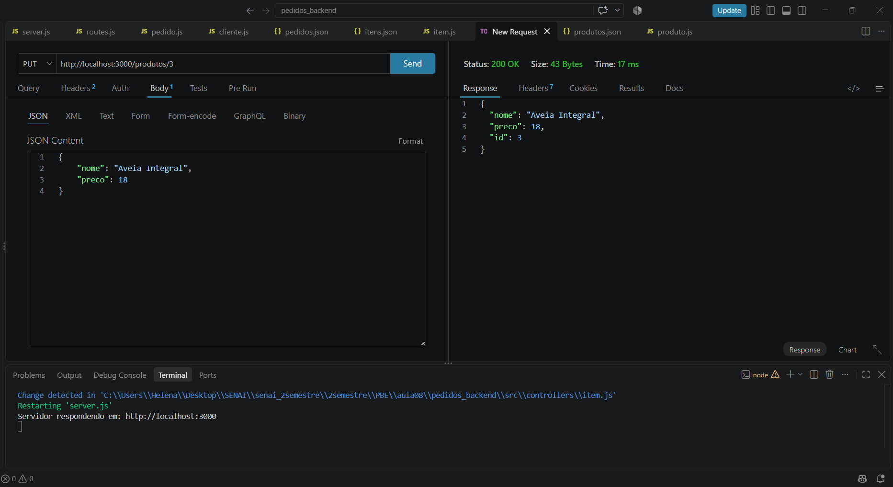
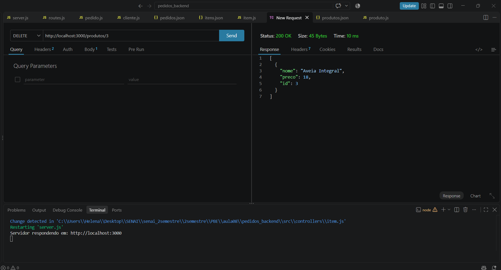
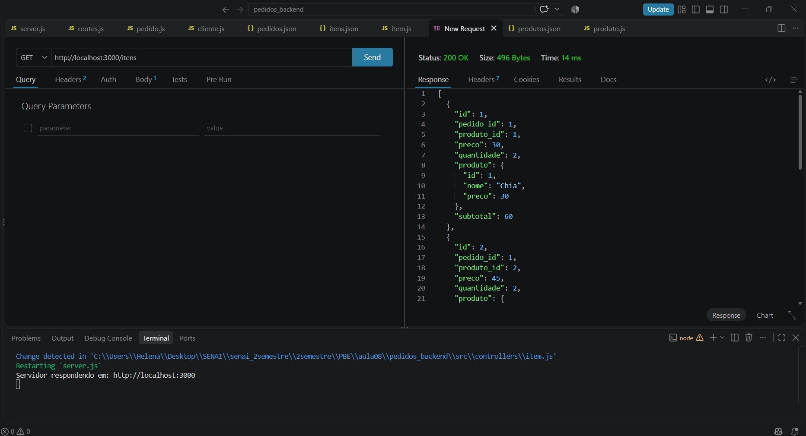
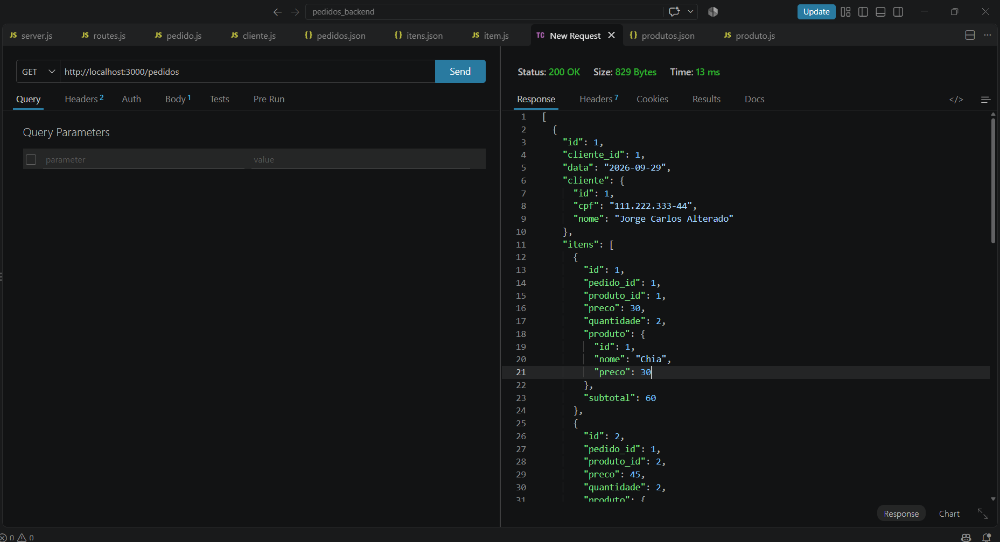
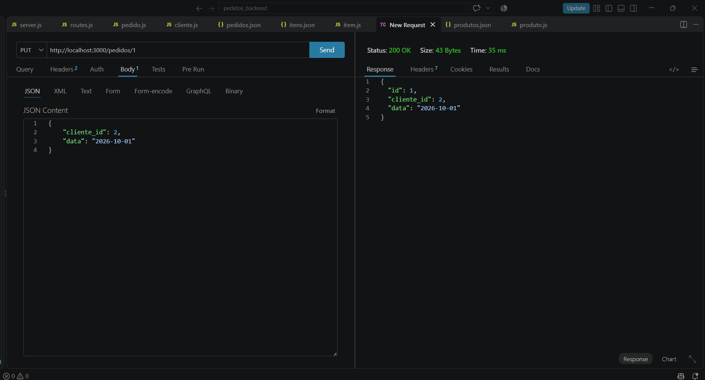
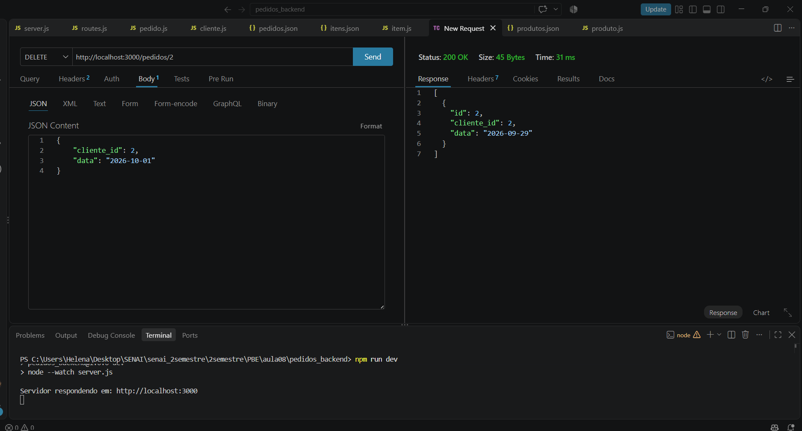

# Aula 08 - UML DC

## Projeto

Nesta aula foi desenvolvida uma API de pedidos utilizando Node.js, Express e MVC.

O projeto trabalha com clientes, produtos, itens e pedidos, utilizando arquivos JSON para armazenar os dados.

## Tecnologias

- Node.js
- Express
- JavaScript
- JSON
- Thunder Client

## Como executar

Instalar as dependências:

```bash
npm install
````

Iniciar o servidor:

```bash
npm run dev
```

Servidor:

```text
http://localhost:3000
```

## CRUD

Foram realizadas as operações de criar, listar, alterar e excluir para clientes, produtos, itens e pedidos.

## Relacionamentos UML

* Pedido → Cliente: composição
* Pedido → Itens: agregação
* Item → Produto: composição

Para os relacionamentos foram utilizados os métodos `find()` e `filter()`.

## Subtotal e total

O subtotal dos itens é calculado através do preço e da quantidade:

```js
preco * quantidade
```

Também foi criada a função `calcTotais()` para calcular o total dos pedidos.

## Testes realizados

Os testes da API foram realizados utilizando o Thunder Client.

### Clientes

**01 - Alteração de cliente**
Arquivo: `01-clientes-alterar.png`



**02 - Exclusão de cliente**
Arquivo: `02-clientes-excluir.png`



### Produtos

**03 - Listagem de produtos**
Arquivo: `03-produtos-listar.png`



**04 - Criação de produto**
Arquivo: `04-produtos-criar.png`



**05 - Alteração de produto**
Arquivo: `05-produtos-alterar.png`



**06 - Exclusão de produto**
Arquivo: `06-produtos-excluir.png`



### Itens

**07 - Listagem dos itens e cálculo do subtotal**
Arquivo: `07-itens-listar-subtotal.png`



### Pedidos

**08 - Listagem dos pedidos e cálculo do total**
Arquivo: `08-pedidos-listar-total.png`



**09 - Alteração de pedido**
Arquivo: `09-pedidos-alterar.png`



**10 - Exclusão de pedido**
Arquivo: `10-pedidos-excluir.png`



## Resultado

A atividade foi concluída com os CRUDs, os relacionamentos entre as entidades e os cálculos de subtotal e total dos pedidos.
